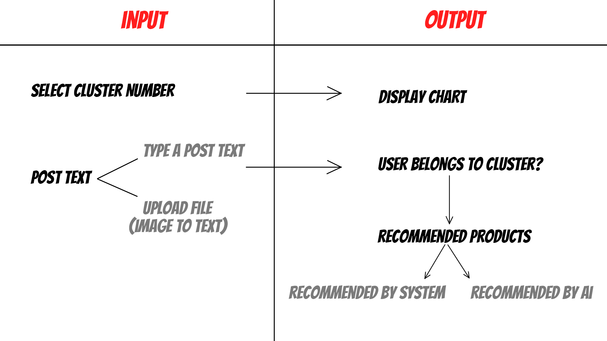

# User Clustering - Eureka

This project is based on the Eureka competition framework with the aim of:
- Analyze social media user behavior: Identify user clusters based on interests, activity, and interaction patterns.
- Determine characteristics of user groups: Highlight common interests, needs, and desires, and their differences across groups.
- Propose strategies and recommend tools: Suggest targeted approaches to engage each group and recommend technologies for efficient data collection and user clustering.

## Final WebApp: [Here](https://eureka-user-clustering.streamlit.app/?embed_options=light_theme) 

## Dataset
The dataset is posts from 300 Twitter users (X) scraped. In this project, the post_text attribute will be used for analysis.

## Features
- **Natural Language Processing**: Use the image to text model on HuggingFace to convert images to text; Use GOOGLE_APIKEY to get the Gemini-Pro model
- **Machine Learning**: Use machine learning models for embedding, keyword extraction, clustering and data dimensionality reduction
- **Streamlit GUI**: Provides an intuitive interface built with Streamlit, accessible to users of all skill levels.
- **Python-based**: Fully developed in Python, highlighting best practices in modern software development.
## How the WebApp Works?

The application operates based on input as text or imaga data (from the user's post). After running, the user's input will be classified into a group of user groups based on the model. machine learning, finally returned are recommended products for that user along with visual charts, from which it is possible to come up with strategies for advertising products for that user.

Refer to the following diagram to understand how the application works:



---

#### Project Organization
```
.
├── README.md                         : report
├── images/                           : contains images
├── products/                         : contains file products
├── app.py                            : web app
├── chart.py                          : contains def chart
├── clean.py                          : contain def clean data
├── .gitignore                        : hide item
└── requirements.txt                  : requirements to run web app  
```


---

#### Tools Used:
- Python (Pandas, Numpy, Scikit-learn, Plotly)
- Streamlit
- HuggingFace
---